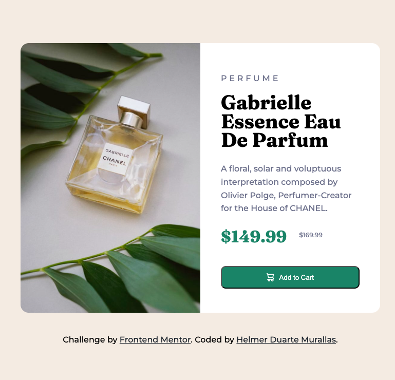

# Frontend Mentor - Product preview card component solution

This is a solution to the [Product preview card component challenge on Frontend Mentor](https://www.frontendmentor.io/challenges/product-preview-card-component-GO7UmttRfa). Frontend Mentor challenges help you improve your coding skills by building realistic projects. 

## Table of contents

- [Overview](#overview)
  - [The challenge](#the-challenge)
  - [Screenshot](#screenshot)
  - [Links](#links)
- [My process](#my-process)
  - [Built with](#built-with)
  - [What I learned](#what-i-learned)
  - [Continued development](#continued-development)
  - [Useful resources](#useful-resources)
  - [AI Collaboration](#ai-collaboration)
- [Author](#author)
- [Acknowledgments](#acknowledgments)

## Overview

### The challenge

Users should be able to:

- View the optimal layout depending on their device's screen size
- See hover and focus states for interactive elements

### Screenshot

### Links

- Solution URL: https://github.com/helmer12/product-preview-card-component
- Live Site URL: https://helmer12.github.io/product-preview-card-component/

## My process

### Built with

- Semantic HTML5 markup
- CSS custom properties
- Flexbox
- Mobile-first workflow
- Responsive images with the <picture> element
- Google Fonts

### What I learned

During this project I practiced semantic HTML structure and responsive layouts using Flexbox. One of the most valuable things I learned was how to use the <picture> element to load different images depending on the screen size.

This is one piece of code I am proud of because it helped me understand responsive images better:

<picture>
  <source
    media="(max-width: 768px)"
    srcset="./images/image-product-mobile.jpg">

  
</picture>

### Continued development

In future projects I want to continue improving:

- Responsive design techniques
- Flexbox and CSS Grid layouts
- Accessibility best practices
- CSS organization and naming conventions
- Writing cleaner and more scalable CSS

I also want to become more confident creating projects without relying too much on trial and error.

### Useful resources

MDN Web Docs - picture element
 - This helped me understand how responsive images work with the <picture> element.

### AI Collaboration

I used ChatGPT during this project mainly for:

- Debugging CSS issues
- Understanding Flexbox behavior
- Learning how the <picture> element works
- Improving semantic HTML structure
- Reviewing accessibility and responsive design decisions

The most helpful part was receiving explanations about why certain CSS properties work, instead of only getting the solution. This helped me better understand concepts like display: flex, display: block, and responsive image handling.

## Author

- Frontend Mentor - @Helmer12
- GitHub - Helmer12

## Acknowledgments

Frontend Mentor. I am really fascinated and happy to complete each challenge gradually. I can see how, step by step, my coding skills are becoming cleaner, more responsive, and more thoughtful.
